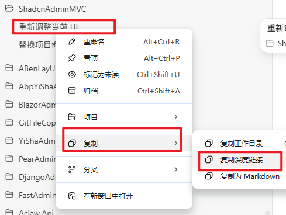

# codex-thread-skills

[简体中文](README.md) | **[English](README.en.md)**

## Codex session cleanup

**Primary purpose: resolve conversations that cannot be archived and remain stuck in the list or sidebar.**

When archiving fails, a conversation persists, or it remains visible after deleting its file and restarting, use `codex-session-cleanup` to locate and remove residual records by thread deep link.

The skill can be used by **Codex or ChatGPT Work** on **Windows and macOS**. It selects a workflow based on actual permissions and the storage layout.

## Included

- Separate Chinese and English guides with a language switch.
- Usage steps, tips and cautions.
- A screenshot showing how to copy a thread deep link.
- Workflows for Codex and ChatGPT Work.
- Windows/macOS support, with automated tests passing on both platforms.

## Use after installation

In another working conversation, copy this prompt and replace the placeholder with the problematic thread's deep link:

```text
Use $codex-session-cleanup to clean up these conversations that cannot be archived
and remain visible, then verify the result:
<paste the thread deep link>
```

For a batch, paste one thread link per line.

## Installation

In an environment with skill installation support, ask the assistant:

```text
Install codex-session-cleanup from https://github.com/turtoncarllyle/codex-thread-skills/tree/main/codex-session-cleanup.
```

Restart the client or open a new task after installation so the skill can be discovered. Running the local cleanup script requires Python 3.10 or newer.

If ChatGPT Work has no skill installer, attach [SKILL.md](codex-session-cleanup/SKILL.md), the [cleanup script](codex-session-cleanup/scripts/cleanup_threads.py) and the [storage guide](codex-session-cleanup/references/storage-map.md), then ask it to follow the skill's workflow.

## Copy the thread deep link



1. Find the problematic conversation in the sidebar.
2. Right-click it. On macOS, a two-finger click or Control-click also works.
3. Open the **Copy** submenu.
4. Select **Copy deep link**.
5. Paste the link into another working conversation for the skill to process.

Example link format:

```text
codex://threads/01a05091-d9cd-7612-b6c2-033360192471
```

This is a format example. Replace it with a conversation you intend to clean up.

## Usage steps

1. Install or load the skill.
2. Copy the problematic thread's deep link.
3. Send the invocation prompt above with the link. The skill locates records, checks the scope, performs authorized cleanup and verifies the result.
4. Restart the client after cleanup and check whether the sidebar has refreshed.

The skill handles source files, related records, indexes and the desktop catalog together. This normally removes the need for another manual archive after restarting. If the entry remains, report it to the assistant for further inspection.

## Codex and ChatGPT Work

| Environment | Workflow |
| --- | --- |
| The assistant has local filesystem and shell access | Verify the target storage, then perform cleanup and verification directly. |
| The assistant runs only in the cloud | It provides local instructions for your operating system. Execute them locally and return the output for verification. |
| The client has a supported native archive or delete interface | Prefer the interface appropriate to the target task and report its actual result. |

This skill cleans tasks backed by supported local Codex storage. Ordinary ChatGPT cloud conversations should use the product's own deletion feature; the local script cannot be applied directly to cloud chat databases.

## Tips

- **Diagnose only:** add “diagnose only, do not delete” to the prompt.
- **Batch cleanup:** provide one problematic thread link per line.
- **Name your system:** tell the assistant whether you use Windows or macOS.
- **Use another working conversation:** avoid asking a thread to delete itself.
- **Restart fully:** use `⌘Q` on macOS; on Windows, also exit any tray instance before reopening.

## Cautions

- Cleanup deletes the specified thread's local records without creating backups. Save any content you want to keep first.
- Only explicitly selected threads are processed. Project source, worktrees and the contents of child conversations are retained.
- Stop a target task if it is still running. A live app can rewrite cached state, which the assistant should account for.
- Without local access, the assistant can only provide instructions; it cannot directly delete records on your computer.
- Historical backups, logs, attachments, cloud copies and forensic erasure are outside the cleanup scope.
- Cleanup relies on recognized internal storage formats. Inspect unknown structures or dependencies before proceeding.

See the [storage and troubleshooting guide](codex-session-cleanup/references/storage-map.md) for details.

## Project files and validation

- [Skill instructions](codex-session-cleanup/SKILL.md)
- [Cleanup script](codex-session-cleanup/scripts/cleanup_threads.py)
- [Isolated tests](tests/test_cleanup.py)
- [Windows/macOS automated tests](https://github.com/turtoncarllyle/codex-thread-skills/actions)

Automated tests use synthetic data to verify exact deletion, desktop catalog cleanup, repeated execution, current-task protection and path boundaries. They do not delete real user conversations. The real client's appearance after restart still needs to be checked.

## License

[MIT License](LICENSE)
