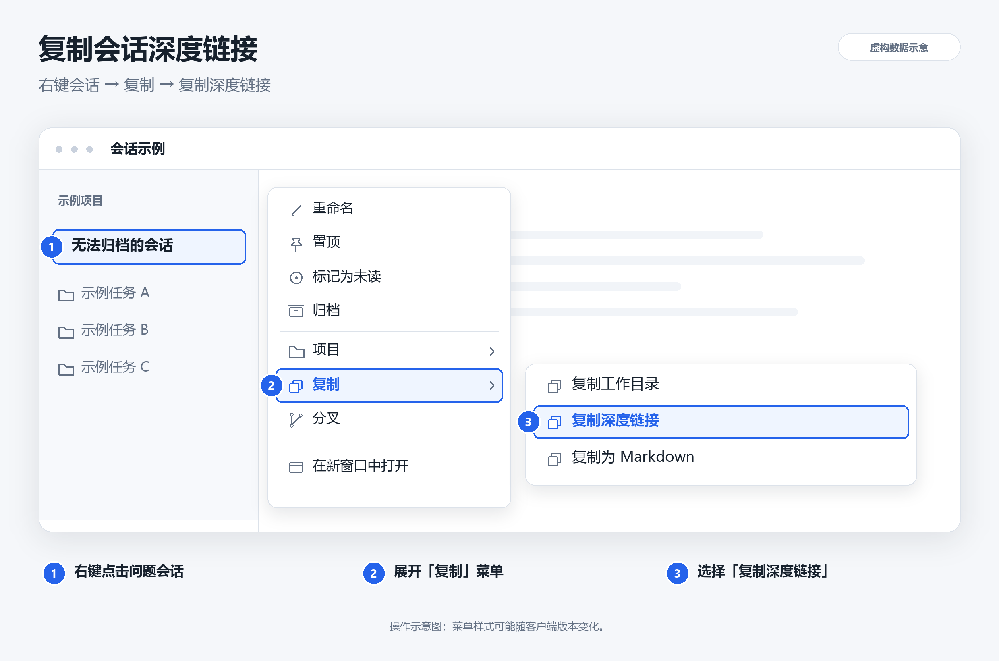

# codex-thread-skills

**[简体中文](README.md)** | [English](README.en.md)

## Codex 会话清理

**核心用途：解决会话无法归档、一直留在列表或侧边栏中的问题。**

当点击归档失败、会话长期存在，或者删除文件后重启仍然显示时，使用 `codex-session-cleanup` 根据会话深度链接定位并清理残留记录。

技能可由 **Codex 或 ChatGPT Work** 使用，覆盖 **Windows 和 macOS**，根据实际权限和存储结构选择执行方式。

## 已包含

- 独立的中文、英文说明，支持切换语言。
- 使用步骤、技巧和注意事项。
- “复制深度链接”操作示意图（使用虚构数据）。
- Codex／ChatGPT Work 的执行方式。
- Windows／macOS 支持，双平台自动测试已通过。

## 安装后这样使用

在另一个正常会话中，复制下面的提示词，把占位符换成问题会话的深度链接即可：

```text
使用 $codex-session-cleanup 清理以下无法归档、一直显示的会话，并核验结果：
<粘贴会话深度链接>
```

多个会话可以每行粘贴一个链接，交给技能批量处理。

## 安装

在支持技能安装的环境中，可以直接告诉助手：

```text
请从 https://github.com/turtoncarllyle/codex-thread-skills/tree/main/codex-session-cleanup 安装 codex-session-cleanup 技能。
```

安装后重启客户端或新建任务，让技能被重新发现。本机运行清理脚本需要 Python 3.10 或更新版本。

如果 ChatGPT Work 没有技能安装入口，可将 [SKILL.md](codex-session-cleanup/SKILL.md)、[清理脚本](codex-session-cleanup/scripts/cleanup_threads.py) 和[存储说明](codex-session-cleanup/references/storage-map.md) 作为任务附件，要求它按技能流程处理。

## 获取会话深度链接



1. 在左侧列表找到有问题的会话。
2. 右键点击该会话；macOS 也可双指点击或按住 Control 点击。
3. 展开「复制」选项。
4. 选择「复制深度链接」。
5. 将链接粘贴到另一个正常会话，交给技能处理。

链接格式示例：

```text
codex://threads/01a05091-d9cd-7612-b6c2-033360192471
```

这是格式示例，使用时请替换成你自己确认要清理的会话链接。

## 使用步骤

1. 安装或加载技能。
2. 复制问题会话的深度链接。
3. 发送上面的调用提示词和链接。技能会定位记录、检查范围、执行已授权的清理并核验结果。
4. 清理完成后重启客户端，查看侧边栏是否已刷新。

技能会同步处理会话源文件、相关记录、索引和桌面目录，通常无需重启后再次手动点击归档。若仍显示，把情况反馈给助手继续检查。

## Codex 与 ChatGPT Work

| 使用环境 | 怎么处理 |
| --- | --- |
| 助手有本机文件和终端权限 | 确认目标存储后直接执行清理与核验。 |
| 助手只能在云端执行 | 助手提供与你的系统匹配的本机操作指引；你执行后，把结果交给它核验。 |
| 客户端有受支持的原生归档或删除接口 | 优先使用与目标任务对应的接口，按实际结果报告。 |

这里清理的是具有受支持 Codex 本地存储的任务。普通 ChatGPT 云端聊天应使用产品自身的删除功能，不能将本地脚本直接套用到云端聊天库。

## 使用技巧

- **只检查原因：**在提示词中加上“只检查，不删除”。
- **批量处理：**每行提供一个问题会话链接。
- **说明系统：**告诉助手你使用 Windows 还是 macOS。
- **换一个正常会话操作：**避免让待删除的会话清理自己。
- **重启刷新：**macOS 使用 `⌘Q` 完全退出；Windows 如有托盘实例，也需退出后再打开。

## 注意事项

- 清理会删除指定会话的本地记录，默认不生成备份。需要保留的内容请先保存。
- 只处理明确指定的会话，不删除项目源码、worktree 或其他子任务的会话本体。
- 目标仍在运行时应先停止该任务；应用运行时可能重新写入缓存，助手会据此选择处理方式。
- 没有本机访问权限时，助手只能提供操作指引，不能直接删除电脑里的记录。
- 历史备份、日志、附件、云端副本及取证级擦除不属于此技能的清理范围。
- 清理依据已识别的内部存储格式；出现未知结构或依赖时先检查，再继续处理。

详细排障信息见[存储与排障说明](codex-session-cleanup/references/storage-map.md)。

## 项目文件与验证

- [技能入口](codex-session-cleanup/SKILL.md)
- [清理脚本](codex-session-cleanup/scripts/cleanup_threads.py)
- [隔离测试](tests/test_cleanup.py)
- [Windows／macOS 自动测试](https://github.com/turtoncarllyle/codex-thread-skills/actions)

自动测试使用模拟数据，验证精确删除、侧边栏目录清理、重复执行、当前任务保护和路径边界等行为，不会删除用户真实会话。真实客户端重启后的显示效果仍需实际查看。

## 许可证

[MIT License](LICENSE)
